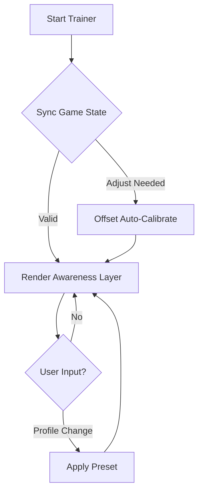

## 🧭 Overview

This trainer functions as a modular enhancement suite: overlays, trackers, rhythm cues, and configurable reactions that flow with the heartbeat of a trial. It shows only what you choose to see, shaping tension into understanding—soft highlights tracing objectives, silhouettes shimmering with motion hints, and optional timing helpers that align with your own natural tempo.

Before you wander deeper, badges await, then features, compatibility tables, a setup path, a living diagram, and a fresh FAQ drawn from the whispers of the Entity’s realm.

---


---

## 🎯 Features

A constellation of modules, each tuned for clarity and subtle advantage:

* **Objective Vision**
  Soft glows encircle generators, totems, lockers, and exits—never overwhelming, always informative.

* **Character Silhouette Tracking**
  Survivors or killers shimmer with distance-scaled contours, remaining understated yet unmistakable.

* **Timing Assist Rhythm**
  A gentle visual pulse to help steady your skill checks without intruding on the music of the match.

* **Soundfield Awareness**
  Optional indicators for directional noises—footsteps, repairs, terror radius shifts—translated as light ripples.

* **Loadout Config Presets**
  Swap instantly between *Stealth*, *Chase*, *Support*, or handmade profiles with a single hotkey.

[!IMPORTANT]
Over-layering too many visuals may disrupt immersion. Enable only what enriches your personal playstyle.

---

## ⚡ Setup & Configuration

To guide your steps between shadow and light:

1. **Download** the latest trainer build.
2. Extract contents into a separate directory.
3. Run the launcher with admin rights to initialize modules.
4. Open your configuration panel and begin with something gentle:

   ```ini
   [stealth]
   obj_radius = 120
   silhouette_alpha = 0.45
   sound_ripple = true
   skillcheck_hint = minimal
   ```
5. Use the overlay menu (`F7` default) to fine-tune brightness, radius, and timing sensitivity.

[!NOTE]
Players on older GPUs may enable “Lite Mode” for smoother frame pacing.

---

## 🌿 Mermaid Diagram — Core Trainer Loop

A soft illustration of how the tool flows with each heartbeat of the trial:



---

## 🔧 Additional Capabilities

* Dynamic terror-radius ring with fade-in transitions.

* Independent generator and hook highlight scaling for clearer pathing.

* Custom hotkeys:

  * `CTRL + H` — toggle silhouettes
  * `ALT + J` — switch presets
  * `SHIFT + R` — soundfield ripple mode

* Custom rarity colors for chests & map objects.

* Night-friendly “moonlit” theme for darker realms.

[!WARNING]
Avoid using extreme brightness settings—they can obscure map readability.

---

## ❓ FAQ — Voices from the Fog

**Q: Does this modify gameplay balance directly?**
A: No, it is a visualization and cue-enhancement layer operating only on your client.

**Q: Can I build unlimited custom profiles?**
A: Yes—create as many `.cfg` presets as you like.

**Q: How often is it updated?**
A: The build includes an auto-adjust system for minor patches; major versions receive manual updates.

**Q: Does it reduce performance?**
A: Only slightly during heavy chases; Lite Mode is available for lower-end machines.

**Q: Does it support key remapping?**
A: Fully—every overlay and assistant module can be rebound.

---

## 🌙 Final Thoughts

The Entity’s realm is a place of dread and poetry, of choices made in flickering lanternlight. With the **Dead by Daylight Trainer**, you carry a quiet companion—one that illuminates, interprets, and steadies your hand. Tune it softly, shape it to your rhythm, and let clarity find you in the fog.

---
